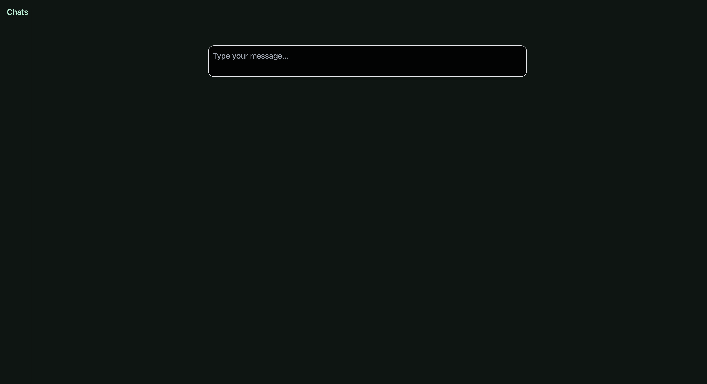
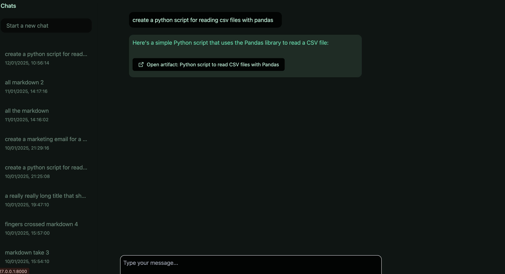
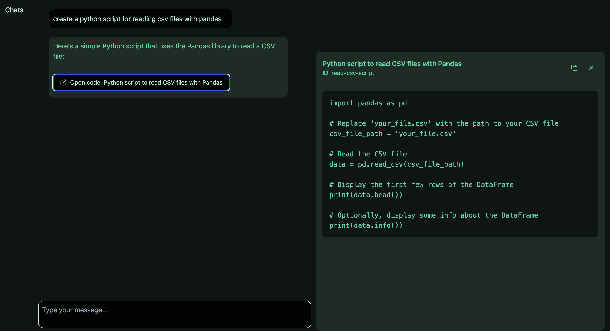

# LLM Chat App

A React & Django llm-powered chat app.

Heavily inspired by [Claude][claude-link] - the app prompts the llm to output artifacts where necesary and the frontend renders them side-by-side with the main chat conversation.

## Pics

New chat window

Basic conversation window

Open artifacts window

<!-- Links -->

[claude-link]: https://www.claude.ai
