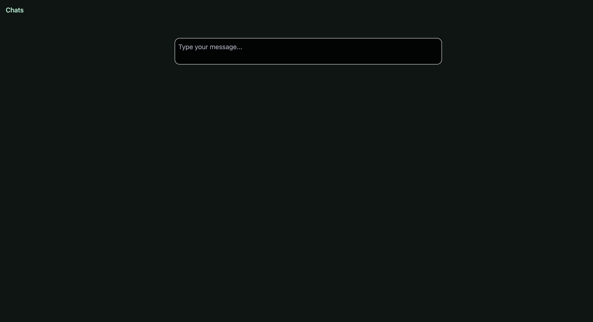
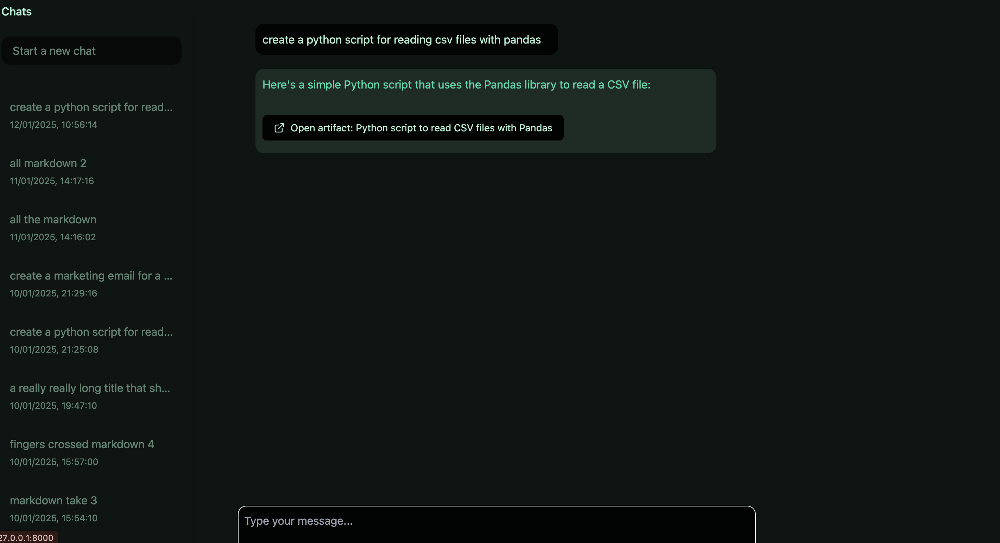
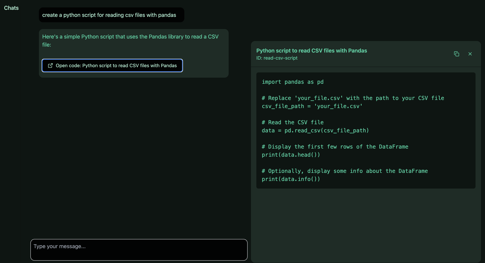

# LLM Chat App

A React & Django llm-powered chat app with Agent Skills support.

Heavily inspired by [Claude][claude-link] - the app prompts the llm to output artifacts where necesary and the frontend renders them side-by-side with the main chat conversation.

## Agent Skills

This application uses Claude Agent Skills to provide specialized capabilities. Skills are automatically invoked by Claude when relevant to your request, using progressive disclosure to load only the content needed for each task.

### Available Skills

-   **Marketing Tone** - Applies brand voice guidelines for marketing content (social media, product descriptions, campaigns)
-   **Technical Docs** - Technical writing style for documentation and API references
-   **Concise Mode** - Brief, direct responses with minimal explanation
-   **Code Review** - Structured code review format with severity levels
-   **Structured Report** - Professional report format with executive summary and sections

Skills are located in `backend/.claude/skills/` and are automatically discovered by the Claude Agent SDK.

### How Skills Work

Skills use a progressive disclosure model:

-   **Level 1 (Metadata)**: Skill name and description loaded at startup (~100 tokens per skill)
-   **Level 2 (Instructions)**: Full skill content loaded only when triggered by relevant queries
-   **Level 3 (Resources)**: Supporting files accessed on-demand without consuming context

This means you can have many skills available with minimal context overhead - Claude only loads what's needed for each conversation.

### Adding New Skills

To create a new skill:

1. Create a directory: `backend/.claude/skills/your-skill-name/`
2. Add a `SKILL.md` file with YAML frontmatter:

```yaml
---
name: your-skill-name
description: When to use this skill. Be specific about triggers and use cases.
---
# Your Skill Name

Instructions for Claude to follow when this skill is invoked...
```

3. (Optional) Add supporting files like templates, examples, or reference materials

Skills are automatically discovered - no code changes needed.

For more information, see the [Agent Skills documentation](https://platform.claude.com/docs/en/agents-and-tools/agent-skills/overview).

## Pics

New chat window



Basic conversation window



Open artifacts window



<!-- Links -->

[claude-link]: https://www.claude.ai
